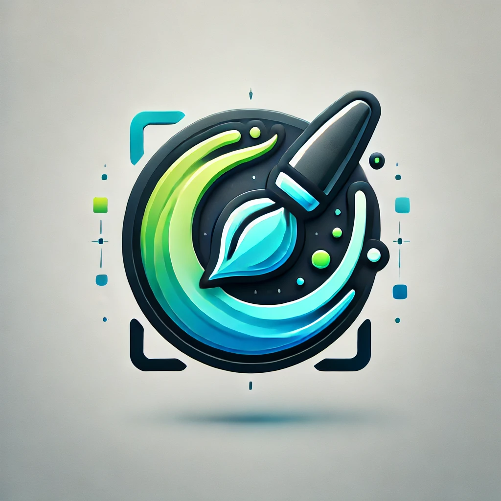

# Image Inpainting Application - Enhanced Edition

A professional image restoration and object removal tool with advanced features and modern UI.



## 🌟 Features

### Core Functionality

- **Advanced Image Inpainting**: Remove unwanted objects or restore damaged areas in images
- **Dual Implementation**: CPU and GPU (CUDA) acceleration support
- **Multiple Algorithms**: Optimized patch-based inpainting with configurable parameters
- **High-Quality Results**: Professional-grade image restoration capabilities

### 🎨 User Interface & Experience

- **Modern Dark Theme**: Eye-friendly dark interface with excellent image visibility
- **Interactive Mask Editor**: Built-in drawing tools for creating custom masks
- **Tabbed Image Viewer**: Switch between input, mask, and result images
- **Real-time Preview**: See mask overlays while drawing
- **Responsive Design**: Adaptive layout that works on different screen sizes

### 🛠️ Advanced Tools

- **Built-in Mask Creator**: Draw masks directly on your images with brush and eraser tools
- **Adjustable Brush Sizes**: Precise control with sizes from 5-100 pixels
- **Opacity Control**: Adjust mask overlay visibility for better precision
- **Comprehensive Help System**: Detailed documentation and parameter guides
- **Keyboard Shortcuts**: Efficient workflow with extensive shortcut support

### 🔧 Technical Features

- **Modular Architecture**: Clean, maintainable codebase with separation of concerns
- **Memory Management**: Intelligent handling of large images with safety limits
- **Error Handling**: Robust error recovery and user-friendly error messages
- **Settings Persistence**: Remembers your preferences and recent files
- **Cross-Platform**: Works on Windows, macOS, and Linux

## 📋 Requirements

### System Requirements

- Python 3.8 or higher
- 4GB RAM minimum (8GB recommended for large images)
- For GPU acceleration: NVIDIA GPU with CUDA support

### Dependencies
```
PySide6>=6.0.0
opencv-python>=4.5.0
numpy>=1.20.0
numba>=0.56.0
numba[cuda]  # Optional, for GPU acceleration
```

## 🚀 Installation

1. **Clone the repository**:
   ```bash
   git clone <repository-url>
   cd image-inpainting-app
   ```

2. **Create virtual environment** (recommended):
   ```bash
   python -m venv venv
   source venv/bin/activate  # On Windows: venv\Scripts\activate
   ```

3. **Install dependencies**:
   ```bash
   pip install -r requirements.txt
   ```

4. **For GPU support** (optional):
   ```bash
   pip install numba[cuda]
   ```

## 🎯 Quick Start

1. **Launch the application**:
   ```bash
   python main.py
   ```

2. **Load an image**:
   - Click "📁 Load Image" or press `Ctrl+O`
   - Select your image file (PNG, JPG, BMP, TIFF supported)

3. **Create or load a mask**:
   - **Option A**: Click "✏️ Create Mask" to draw directly on your image
   - **Option B**: Click "🎭 Load Mask" to use an existing mask file

4. **Adjust parameters** (optional):
   - **Patch Size**: Controls texture analysis detail (3-21, default: 9)
   - **P-Value**: Distance metric for matching (0.1-10.0, default: 1.0)
   - **Implementation**: Choose CPU or GPU acceleration

5. **Run inpainting**:
   - Click "▶️ Run Inpainting" or press `F5`
   - Wait for processing to complete

6. **Save result**:
   - Click "💾 Save" or press `Ctrl+S`
   - Choose your output location and format

## 🎨 Using the Mask Editor

The built-in mask editor allows you to create precise masks directly on your images:

### Tools Available

- **🖌️ Brush Tool**: Draw white areas (regions to inpaint)
- **🧽 Eraser Tool**: Remove mask areas (make them black)
- **Size Slider**: Adjust brush/eraser size (5-100 pixels)
- **Opacity Slider**: Control mask overlay visibility (10-90%)
- **🗑️ Clear All**: Remove entire mask and start over

### Usage Tips

- Masked areas appear as red overlay on your image
- Use smaller brush sizes for precise work
- Use larger brush sizes for filling large areas quickly
- Adjust opacity to see the underlying image clearly
- The "Apply Mask" button is only enabled when you have drawn something

### Keyboard Shortcuts in Mask Editor

- `Left Click + Drag`: Draw/Erase mask
- `Mouse Wheel`: Adjust brush size
- `B`: Switch to Brush tool
- `E`: Switch to Eraser tool
- `Ctrl+A`: Clear all mask
- `Enter`: Apply mask
- `Escape`: Cancel mask editor

## ⌨️ Keyboard Shortcuts

### File Operations

- `Ctrl+O`: Load Input Image
- `Ctrl+M`: Load Mask Image
- `Ctrl+S`: Save Result Image
- `Ctrl+Q`: Exit Application

### Processing

- `F5`: Run Inpainting
- `Ctrl+R`: Reset All

### View Controls

- `Ctrl+1`: Single View Mode
- `Ctrl+2`: Side by Side View
- `Ctrl+=`: Zoom In
- `Ctrl+-`: Zoom Out
- `Ctrl+0`: Zoom to Fit

### Help

- `F1`: Show Help Dialog

## 🔧 Parameter Guide

### Patch Size (3-21)

Controls the size of texture patches used for inpainting analysis:

- **Smaller values (3-7)**: Good for fine details and small objects. Faster processing.
- **Medium values (9-13)**: Balanced approach suitable for most images.
- **Larger values (15-21)**: Better for large areas and smooth textures. Slower processing.

### Minkowski Order (P-Value: 1.0-10.0)

Controls the distance metric used for patch matching:

- **p = 1.0 (Manhattan distance)**: More conservative, preserves structure better
- **p = 2.0 (Euclidean distance)**: Standard distance metric, balanced approach

### Implementation Choice

- **CPU Implementation**: Compatible with all systems, slower processing
- **GPU Implementation**: Requires NVIDIA GPU with CUDA, 10-20x faster

## 🏗️ Architecture

The application follows a clean modular architecture:

```
├── main.py                 # Application entry point
├── config/                 # Configuration and settings
│   └── settings.py
├── models/                 # Data models and business logic
│   ├── image_data.py
│   └── inpaint_worker.py
├── views/                  # UI components
│   ├── main_window_simple.py
│   └── widgets/
│       ├── control_panel.py
│       ├── image_label.py
│       ├── mask_editor.py
│       └── help_dialog.py
└── controllers/            # Application logic coordination
    └── app_controller.py
```

For detailed architecture information, see [README_ARCHITECTURE.md](README_ARCHITECTURE.md).

## 🎨 Dark Theme

The application features a modern dark theme designed for:

- **Better Image Visibility**: Dark backgrounds provide excellent contrast for viewing images
- **Eye Comfort**: Reduced eye strain during extended use
- **Professional Appearance**: Modern, sleek interface design
- **Consistent Styling**: Unified dark theme across all components

## 🆘 Troubleshooting

### Common Issues

**GPU Not Available**

- Ensure you have an NVIDIA GPU with CUDA support
- Install CUDA toolkit and drivers
- Install numba with CUDA support: `pip install numba[cuda]`
- Use CPU implementation as fallback

**Poor Inpainting Results**

- Try different patch sizes (start with 9, then try 7 or 13)
- Adjust p-value (try 1.0 for Manhattan distance)
- Ensure mask doesn't cover too large an area
- Check that surrounding areas have sufficient texture/detail

**Slow Processing**

- Use GPU implementation if available
- Reduce patch size (try 7 or 5)
- Resize image to smaller dimensions before processing
- Reduce the size of masked areas

**Memory Issues**

- Reduce image size before processing
- Use smaller patch sizes
- Close other applications to free memory
- Switch from GPU to CPU implementation

For more detailed troubleshooting, press `F1` in the application to access the comprehensive help system.

## 📝 Recent Updates

### Version 1.1.0 - Enhanced Edition

#### 🎨 User Interface Improvements

- **Dark Theme**: Complete dark theme implementation for better image visibility
- **Interactive Mask Editor**: Built-in drawing tools for creating custom masks
- **Tabbed Interface**: Clean organization of input, mask, and result images
- **Modern Styling**: Professional appearance with improved visual hierarchy

#### 🛠️ New Features

- **Mask Creation Tools**: Brush and eraser tools with adjustable sizes
- **Comprehensive Help System**: Detailed documentation with multiple sections
- **Enhanced Error Handling**: User-friendly error messages and recovery
- **Settings Persistence**: Remembers preferences and recent files

#### 🏗️ Technical Improvements

- **Modular Architecture**: Clean separation of concerns for maintainability
- **Memory Management**: Intelligent handling of large images
- **Performance Optimizations**: Improved processing efficiency
- **Cross-Platform Compatibility**: Enhanced support for different operating systems

#### 🔧 Quality of Life

- **Keyboard Shortcuts**: Extensive shortcut support for efficient workflow
- **Parameter Tooltips**: Helpful hints for optimal parameter selection
- **Real-time Feedback**: Progress indicators and status updates
- **Improved File Handling**: Better support for various image formats

## 🤝 Contributing

Contributions are welcome! Please feel free to submit a Pull Request. For major changes, please open an issue first to discuss what you would like to change.

## 📄 License

This project is licensed under the MIT License - see the LICENSE file for details.

## 🙏 Acknowledgments

- Built with PySide6 for the modern Qt-based interface
- OpenCV for image processing capabilities
- Numba for high-performance computing acceleration
- CUDA for GPU acceleration support

---

**Note**: This application is designed for educational and research purposes. For commercial use, please ensure compliance with all relevant licenses and regulations. 